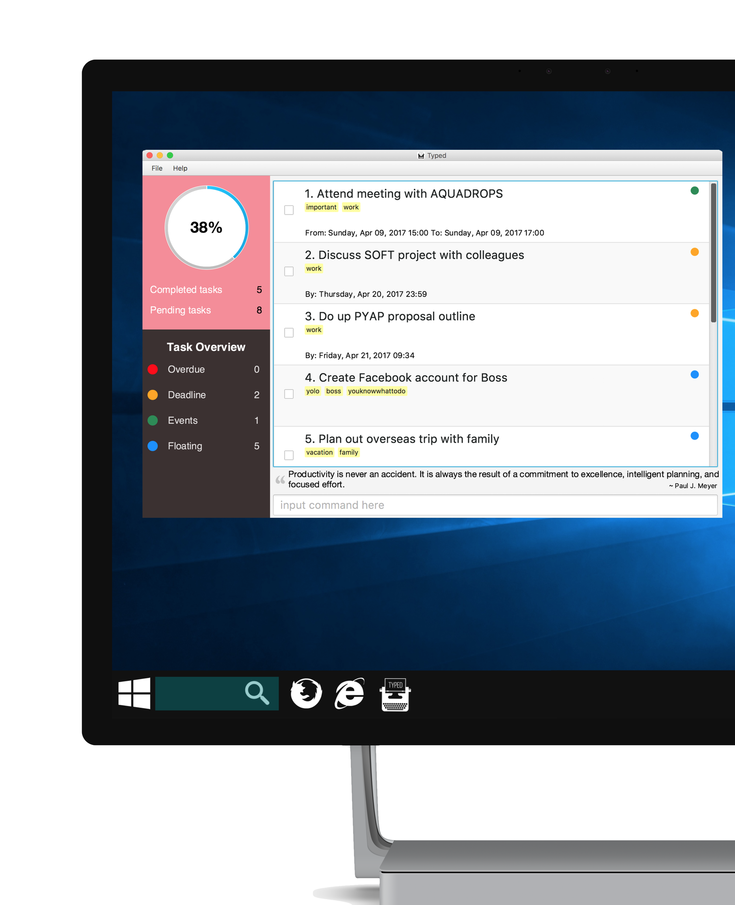

# Typed

  
Typed is a task manager application created for avid typers. It comes with a graphical user interface, but relies primarily on keyboard commands. This application is currently available on desktops only.

#### Site Map 
* [User Guide](docs/UserGuide.md)
* [Developer Guide](docs/DeveloperGuide.md)
* [Learning Outcomes](docs/LearningOutcomes.md)
* [About Us](docs/AboutUs.md)
* [Contact Us](docs/ContactUs.md)

#### Acknowledgements 
* This application was developed from the educational sample 
  [Address Book Level 4](https://github.com/nus-cs2103-AY1617S1/addressbook-level4/) base code.
* Some parts of the original base code were inspired by the excellent
  [Java FX tutorial](http://code.makery.ch/library/javafx-8-tutorial/) by *Marco Jakob*.

#### Licence : [MIT](LICENSE)
