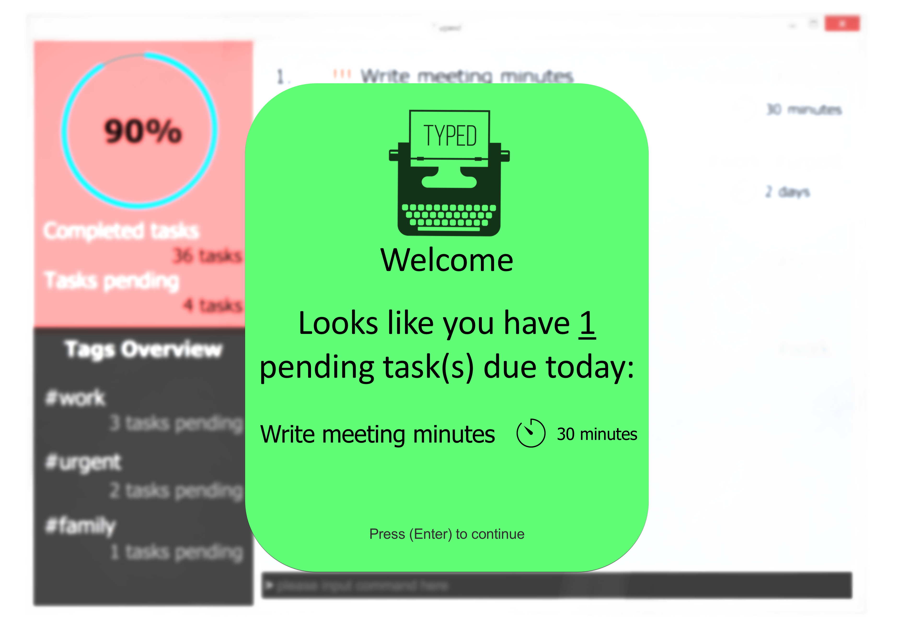
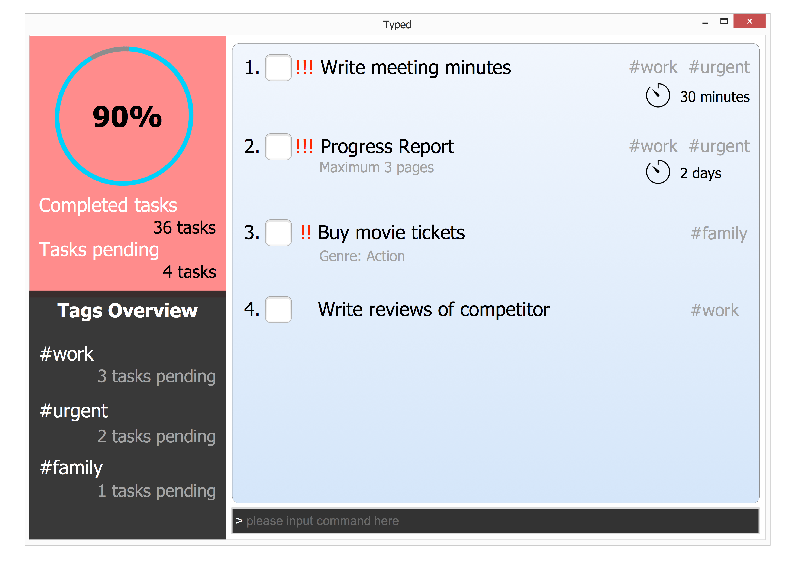

# Typed - User Guide

By : `Typedwriters`  &nbsp;&nbsp;&nbsp;&nbsp; Since: `March 2017`  &nbsp;&nbsp;&nbsp;&nbsp; Licence: `MIT`

---

## About Me

Hello, my name is *Typed*.   

Do you feel overwhelmed with deliverables and looming deadlines? Are you tired of writing your to-dos and schedule on a paper only to misplace that paper? Put your papers and worries away, for I am here to help you!  

I will be your personal task manager, storing thousands of tasks with no additional weight. You will be greeted with the more urgent tasks daily, to help you prioritise the day better. You may choose to pull up a calendar view of upcoming events, or sort your tasks by deadline, priority or type. Not sure if you saved the task under *Cara* or *Sara*? I have you covered! Search with either term and I will find what you are looking for. You can even dress me in the theme that pleases you most, should you dislike the way I look.  

Unlike other high-maintenance task managers, I am simply simple. Gone are the days of getting frustrated from navigating unfriendly and unintuitive interfaces. With me, there is no need to reach for the mouse anymore. Continue typing on your favourite keyboard, and I will address your commands accordingly.  

Ready to be productive? Here we go! :muscle: 

1. [Getting Started](#1-getting-started)
2. [Returning to *Typed*](#2-returning-to-typed)
3. [Features](#3-features)
4. [Command Summary](#4-command-summary)
5. [FAQ](#5-faq)

## 1. Getting Started 

With seemingly never-ending work and errands, it is easy to lose track of what is coming up next. With me, you will not forget another deadline or miss another event. I know it can be difficult to organise and prioritise tons of accumulated tasks. Leave the mess for me to handle, and focus on getting work done instead.   

Before you get started with me, you should have Java version `1.8.0_60` or later installed.  

1. Download the latest `typed.jar` from the **[releases](../../../releases)** tab.
2. Copy the file to the folder you want to use as my new home.
3. Press the Ctrl+Shift+T key to launch me. I will welcome you in just a few seconds.
4. Walk through the tutorial to try out basic features, or experiment with **[3. Features](#3-features)** below.

## 2. Returning to *Typed*

I am always happy to see you again! Forget the tutorial you saw the first time, and get ready for a productive day.  

1. You will be greeted with a view of today's focus. This view includes events happening today, tasks due today, as well as your overdue tasks.  

      
    
2. Let me know when you are done viewing today's focus by pressing <kbd>Enter</kbd>. 
3. This brings you to the default view, with all your undone tasks sorted by priority. 

      

4. Start typing any command and press <kbd>Enter</kbd> to execute it. 

## 3. Features

**Command Format**  

Words in `UPPER_CASE` are the parameters.  
Words in `lower_case` are the exact strings.  
Items in `SQUARE_BRACKETS` are optional.  
Items with `...` after them can have multiple instances.  

### 3.1. Getting Some Help

#### 3.1.1. Help for All Commands : `help`

Format: `help`  
> `help` shows you an overview of all the commands and their usage information.  

*e.g. help*  

#### 3.1.2. Help for Specific Command : `help COMMAND`

Format: `help COMMAND`  
> `help COMMAND` shows you a detailed explanation of the command's usage information. 

### 3.2. Adding a Task or Event

#### 3.2.1. Adding a Task or Event by Title Only: `add TITLE`

Format: `add TITLE`

> `add TITLE` adds your task or event described by TITLE with no additional information.  
> Your choice of TITLE should contain only alphanumeric characters.

*e.g. add read 1984 george orwell*  

#### 3.2.1. Adding a Task with Deadline: `add TITLE by DATE`

Format: `add TITLE by DATE`

> `add TITLE by DATE` adds your task along with its due date.  
> DATE takes the format DD/MM/YYYY.

*e.g. add lose 10 kg by 14/02/2014*  

#### 3.2.3. Adding a Recurring Task or Event: `add TITLE every FREQUENCY`

Format: `add TITLE every FREQUENCY`

> `add TITLE every FREQUENCY` adds an automatically recurring task or event according to the specified FREQUENCY.  
> You may indicate either `daily`, `monthly` or `yearly` when specifying FREQUENCY.  
> The recurrence will be calculated beginning from the day you enter the task.

*e.g. add boss' birthday every year*  

#### 3.2.4. Adding an Event with a Duration: `add TITLE from DATE to DATE`

Format: `add TITLE from DATE to DATE`

> `add TITLE from DATE to DATE` adds your event that is happening over days.

*e.g. add company retreat in Malaysia from 01/01/2017 to 05/01/2017*  

#### 3.2.5. Adding a Task or Event with Tags: `add TITLE #TAG ..`

Format: `add TITLE #TAG ..`

> `add TITLE #TAG ..` adds your task or event with one or more tags that allow for easy categorisation and retrieval.  
> #TAG must contain only alphanumeric characters.  
> Tagging is compatible with all the other `add` commands. 

*e.g. add plank for 2 minutes #fit*  
*e.g. add write minutes by 25/12/2017 #work #urgent #bosssays*  

### 3.3. Listing Tasks and Events

#### 3.3.1. Listing a Task or Event : `list`

Format: `list`

> `list` shows you your tasks and events in a similar manner as the default page.  

*e.g. list*  

#### 3.2.2. Listing a Task or Event : `list TYPE`

Format: `list TYPE`

> `list TYPE` shows you your tasks and events sorted by TYPE.  
> Valid formats for TYPE include events, done, undone and all.

*e.g. list done*  

### 3.4. Editing a Task or Event

#### 3.4.1. Editing Title of a Task or Event : `edit INDEX NEW_TITLE`

Format: `edit INDEX NEW_TITLE `

> `edit INDEX NEW_TITLE` changes the title of the task or event specified by INDEX.  
> INDEX is a positive integer referring to the index number shown on your *Typed* screen.  

*e.g. edit 1 buy green apples*  

#### 3.4.2. Editing Deadline of a Task or Event : `edit INDEX by DATE`

Format: `edit INDEX by DATE `

> `edit INDEX by DATE` changes the deadline of the task or event specified by INDEX.   
> If you would like to remove a deadline from a task or event, simply enter `edit INDEX by `.  

*e.g. edit 1 by 05/05/2017*  
*e.g. edit 1 by*  

#### 3.4.3. Editing Tags of a Task or Event : `edit INDEX #TAG .. `

Format: `edit INDEX #TAG .. `

> `edit INDEX by #TAG` replaces the original tags of the task or event specified by INDEX with the new tags given in the command.   
> If you would like to remove all associated tags in a task or event, use `edit INDEX # `.  

*e.g. edit 1 #i #can #add #anything #i #want*  
*e.g. edit 1 #*  

#### 3.4.4. Editing Multiple Fields of a Task or Event : `edit INDEX [TITLE] [DATE] [#TAG] .. `

Format: `edit INDEX [TITLE] [DATE] [#TAG] .. `

> `edit INDEX [TITLE] [DATE] [#TAG] .. ` updates the specified fields with new values, if any.   
> You should provide minimally one of the optional fields when using this command format.  

*e.g. edit 1 buy groceries by 05/05/2017*  
*e.g. edit 1 buy groceries by*  

### 3.5. Finding Tasks and Events

#### 3.5.1. Find a Task or Event by Title : `find KEYWORD ..`

Format: `find KEYWORD ..`

> `find KEYWORD ..` finds all your tasks and events containing KEYWORD in their title.  
> Fuzzy find is used to include similar words, e.g. `Sara` will match `Cara`.  
> The search is not case sensitive, e.g `boss` will match `Boss`.  
> The order of the keywords does not matter, e.g. `Hans Bo` will match `Bo Hans`.  
> Tasks or events matching at least one keyword will be returned (i.e. `OR` search), e.g. `Expo` will match `IT Expo`.  

*e.g. find Jonny finance*  

#### 3.5.2. Find a Task or Event by Tag : `find #TAG ..`

Format: `find #TAG ..`

> `find #TAG ..` finds all your tasks and events tagged with #TAG.  
> Fuzzy find is used to include similar words, e.g. `#work` will match `#werk`.  
> The search is not case sensitive, e.g `#boss` will match `#Boss`.  
> The order of the tags does not matter, e.g. `#work #urgent` will return the same results as `#urgent #work`.  
> Tasks or events matching at least one tag will be returned (i.e. `OR` search), e.g. `#work` will match a task that is tagged with `#work #it`.  

*e.g. find #dope #chill #urgent*  

### 3.6. Deleting Tasks and Events

#### 3.6.1. Deleting One Task or Event : `delete INDEX `

Format: `delete INDEX`

> `delete INDEX` removes a task or event identified by INDEX.  
> INDEX is a positive integer referring to the index number shown on your *Typed* screen.  

*e.g. delete 2*  

#### 3.6.2. Deleting Multiple Tasks or Events : `delete INDEX to INDEX `

Format: `delete INDEX to INDEX`

> `delete INDEX to INDEX` removes a range of tasks or events identified by INDEX.  
> INDEX is a positive integer referring to the index number shown on your *Typed* screen.  

*e.g. delete 2 to 8*  

#### 3.6.3. Deleting All Tasks or Events : `delete all `

Format: `delete all` 

> `delete all` removes all stored tasks and events.  

*e.g. delete all*  

### 3.7. Undoing Actions

#### 3.7.1. Undoing One Action : `undo`

Format: `undo`

> `undo` restores *Typed* to its state before the last action was performed.  
> Only mutable commands, e.g. `add`, `edit`, `delete` can be undone.  
> `undo` supports only actions performed within the same session. 
> > Each time you launch *Typed*, a new session is started. When you exit or quit *Typed*, this session ends and is not carried forward to your next launch.  

*e.g. undo*  

#### 3.7.2. Undoing Multiple Actions : `undo NUMBER`

Format: `undo NUMBER`

> `undo NUMBER` restores *Typed* to its state before the last NUMBER actions were performed.  

*e.g. undo 5*  

#### 3.7.3. Undoing All Actions : `undo all`

Format: `undo all`

> `undo all` restores *Typed* to its state before all actions were performed.  

*e.g. undo 5*  

### 3.8. Redoing Actions

#### 3.8.1. Redoing One Action : `redo`

Format: `redo`

> `redo` restores *Typed* to its state before the last `undo` action was performed.  
> Only an `undo` action can be redone.  
> `redo` supports only `undo` actions performed within the same session.  
> > Each time you launch *Typed*, a new session is started. When you exit or quit *Typed*, this session ends and is not carried forward to your next launch.  

> If a mutable command, e.g. `add`, `edit`, `delete` is executed after an `undo`, `redo` will no longer be available.  

*e.g. redo*

#### 3.8.2. Redoing Multiple Actions : `redo NUMBER`

Format: `undo NUMBER`

> `redo NUMBER` restores *Typed* to its state before the last NUMBER `undo` actions were performed.  

*e.g. redo 3*  

#### 3.8.3. Redoing All Actions : `redo all`

Format: `redo all`

> `redo all` restores *Typed* to its state before all `undo` actions were performed.  
> You can only `redo` as many times as you `undo`.

*e.g. redo all*  

### 3.9. Completing Tasks

#### 3.9.1. Completing One Task : `complete INDEX `

Format: `complete INDEX`

> `complete INDEX` marks a task identified by INDEX as completed.  
> INDEX is a positive integer referring to the index number shown on your *Typed* screen.  

*e.g. complete 2*  

#### 3.9.2. Completing Multiple Tasks : `complete INDEX to INDEX `

Format: `complete INDEX to INDEX`

> `complete INDEX to INDEX` marks a range of tasks identified by INDEX as done.  
> INDEX is a positive integer referring to the index number shown on your *Typed* screen.  

*e.g. complete 2 to 8*  

#### 3.9.3. Completing All Tasks : `complete all `

Format: `complete all` 

> `complete all` marks all undone tasks as complete.  

*e.g. complete all*  

### 3.10. Showing History

#### 3.10.1. Showing History : `history`

Format: `history`

> `history` shows you a list of all executed actions in the current session.

*e.g. history*  

### 3.11. Saving Your Data

#### 3.11.1. Saving Your Data to the Current File: 

> Good news! Your data is automatically saved.

#### 3.11.2. Saving Your Data to Another File : `save FILENAME`

Format: `save FILENAME`

> `save FILENAME` saves all your data to a new file specified by FILENAME.  
> FILENAME must contain a .xml extension to be valid.

*e.g. save mynewtasks.xml*  

### 3.12. Exiting *Typed*

#### 3.12.1. Exiting *Typed* : `exit `

Format: `exit`

> `exit` closes *Typed*.  
> Once again, your data is automatically saved upon exiting the program!

*e.g. exit*  

## 4. Command Summary

Command | Format |
-------- | :-------- |
`help` | [help](#help)   [help COMMAND](#specificHelp)|
`add` | [add TITLE](#addTitle)   [add TITLE by DATE](#addTitleDate)   [add TITLE every FREQUENCY](#addRecurring)   [add TITLE from DATE to DATE](#addEventDuration)   [add TASK #TAG ..](#addTaskTag)|
`list` | [list](#list)   [list TYPE](#listType)|

* **Add**  `add TASK [ on DATE | by DATE | every RECURRENT | from DATE to DATE] [#TAG] [#MORE_TAGS]....`  
  e.g. `add read the little prince`  
  e.g. `add push git commit by next wednesday`  
  e.g. `add write blog post every day #/hobby`  
  e.g. `add meet boss every monday`  
  e.g. `add release paycheck every month`  
  e.g. `add my birthday every year`  
  e.g. `add training camp from 2 May to 5 May`  
  e.g. `add drinks with client tomorrow from 1PM to 2PM`  
  e.g. `add clean room on Sunday`  

* **Complete**  `complete [all]|INDEX [ to | ,] [INDEX] ...`  
  e.g. `complete 2`  
  e.g. `complete 2 to 10`  
  e.g. `complete 1,3,5`  
  e.g. `complete 1, 3, 5 to 10`  
  e.g. `complete all`  

* **Delete** : `delete [all]|INDEX [ to | ,] [INDEX] ...`  
  e.g. `delete 2`  
  e.g. `delete 2 to 10`  
  e.g. `delete 1,3,5`  
  e.g. `delete 1, 3, 5 to 10`  
  e.g. `delete all`  

* **Edit** : `edit INDEX [DESCRIPTION] [by DATE | TIME] [ #TAG | -#TAG ]`  
  e.g. `edit 1 by following Saturday`  
  e.g. `edit 2 on 2 May`  
  e.g. `edit 4 from 13:00 to 5pm`  
  e.g. `edit 3 every Wednesday`  
  e.g. `edit 7 play mousehunt`  
  e.g. `edit 5 +#work`  
  e.g. `edit 6 -#supplier`  

* **Find** : `find KEYWORD|#TAGS [MORE_KEYWORDS | #MORE_TAGS]...`  
  e.g. `find johnny depp`  
  e.g. `find boss #work`  
  e.g. `find #forever #alone`  

* **Help** : `help`  
  e.g. help  

* **History** : `history`  
  e.g. `history`  

* **List** : `list TYPE`  
  e.g. `list`  
  e.g. `list all`  
  e.g. `list undone`  
  e.g. `list done`  
  e.g. `list events`  

* **Redo** : `redo [INDEX|all]`  
  e.g.`redo`  
  e.g.`redo 5`  
  e.g.`redo all`  

* **Save** : `save FILENAME`  
  e.g.`save newfile.txt`  

* **Quit** : `quit`  
  e.g.`quit`  

* **Undo** : `undo [INDEX|all]`  
  e.g.`undo`  
  e.g.`undo 5`  
  e.g.`undo all`  

## 5. FAQ

**Q**: How do I transfer my data to another Computer? 
**A**: Install the app in the other computer and overwrite the empty data file it creates with
       the file that contains the data of your previous Typed folder.

**Q**: How do I backup my data to another location? 
**A**: Copy the saved Typed file to any desired location of your choice. Alternatively,
       use our in-built backup feature as described in the [Features](#features) section above. 

**Q**: Is my personal data and information kept secure from the eyes of others (including the dev team)? 
**A**: Yes! Everything you enter into Typed is only stored on your local machine in your specified storage file. 
