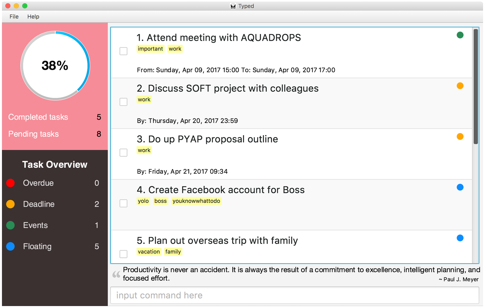
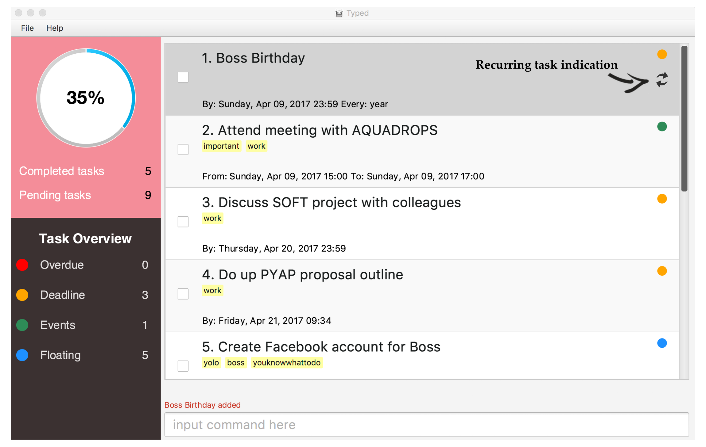

# Typed - User Guide

By : `Typedwriters`  &nbsp;&nbsp;&nbsp;&nbsp; Since: `March 2017`  &nbsp;&nbsp;&nbsp;&nbsp; Licence: `MIT`

---

## About Me

Hello, my name is *Typed*.   

Do you feel overwhelmed with deliverables and looming deadlines? Are you tired of writing your to-dos and schedule on a paper only to misplace that paper? Put your papers and worries away, for I am here to help you!  

I will be your personal task manager, storing thousands of tasks with no additional weight. You will be greeted with the more urgent tasks daily, to help you prioritise the day better. You may choose to pull up a calendar view of upcoming events, or sort your tasks by deadline, priority or type. Not sure if you saved the task under *Cara* or *Sara*? I have you covered! Search with either term and I will find what you are looking for. You can even dress me in the theme that pleases you most, should you dislike the way I look.  

Unlike other high-maintenance task managers, I am simply simple. Gone are the days of getting frustrated from navigating unfriendly and unintuitive interfaces. With me, there is no need to reach for the mouse anymore. Continue typing on your favourite keyboard, and I will address your commands accordingly.  

Ready to be productive? Here we go! 💪 

1. [Getting Started](#1-getting-started)
2. [Returning to *Typed*](#2-returning-to-typed)
3. [Features](#3-features)
4. [Command Summary](#4-command-summary)
5. [FAQ](#5-faq)

## 1. Getting Started 

With seemingly never-ending work and errands, it is easy to lose track of what is coming up next. With me, you will not forget another deadline or miss another event. I know it can be difficult to organise and prioritise tons of accumulated tasks. Leave the mess for me to handle, and focus on getting work done instead.   

Before you get started with me, you should have Java version `1.8.0_60` or later installed.  

1. Download the latest `typed.jar` from the **[releases](../../../releases)** tab.
2. Copy the file to the folder you want to use as my new home.
3. Experiment with **[3. Features](#3-features)** below and try out basic features.

      

## 2. Returning to *Typed*

I am always happy to see you again! 

1. You will be greeted with a view of default view, with all your undone tasks sorted by deadline. On the left, you will be able to see the overview of each individual type of tasks on hand: overdue, tasks with deadline, events and floating tasks. 

      

2. Start typing any command and press <kbd>Enter</kbd> to execute it. 

## 3. Features

**Command Format**  

Words in `UPPER_CASE` are the parameters.  
Words in `lower_case` are the exact strings.  
Items in `SQUARE_BRACKETS` are optional.  
Items with `..` after them can have multiple instances.  

### 3.1. Getting Some Help

#### 3.1.1. Help for All Commands : `help`

Format: `help`  
> `help` shows you an overview of all the commands and their usage information.  

*e.g. help*  

### 3.2. Adding a Task

#### 3.2.1. Adding a Task by Title Only: `add TITLE`

Format: `add TITLE`

> `add TITLE` adds your task described by TITLE with no additional information.  
> Your choice of TITLE should contain only alphanumeric characters.

*e.g. add read 1984 george orwell*  

#### 3.2.2. Adding a Task with Deadline: `add TITLE by DATE`

Format: `add TITLE by DATE`

> `add TITLE by DATE` adds your task along with its due date.  
> DATE takes the format DD/MM/YYYY.

*e.g. add lose 10 kg by 14/02/2014*  

#### 3.2.3. Adding a Task with Occurrence Date: `add TITLE on DATE`

Format: `add TITLE on DATE`

> `add TITLE on DATE` adds your task along with the date it is happening on.  
> DATE takes the format DD/MM/YYYY.

*e.g. add Open Day on 10/02/2014*  

#### 3.2.4. Adding a Recurring Task: `add TITLE every FREQUENCY`

Format: `add TITLE every FREQUENCY`

> Note: Support for this has not been implemented.  
> `add TITLE every FREQUENCY` adds an automatically recurring task according to the specified FREQUENCY.  
> You may indicate either `day`, `month` or `year` when specifying FREQUENCY.  
> The recurrence will be calculated beginning from the day you enter the task unless otherwise specified.

*e.g. add boss' birthday on 9th apr every year*  

  

#### 3.2.5. Adding a Task with a Duration: `add TITLE from DATE to DATE`

Format: `add TITLE from DATE to DATE`

> `add TITLE from DATE to DATE` adds your task that is happening over days.

*e.g. add company retreat in Malaysia from 01/01/2017 to 05/01/2017*  

#### 3.2.6. Adding a Task with Tags: `add TITLE #TAG ..`

Format: `add TITLE #TAG ..`

> `add TITLE #TAG ..` adds your task with one or more tags that allow for easy categorisation and retrieval.  
> #TAG must contain only alphanumeric characters.  
> Tagging is compatible with all the other `add` commands. 

*e.g. add plank for 2 minutes #fit*  
*e.g. add write minutes by 25/12/2017 #work #urgent #bosssays*  

  

### 3.3. Listing Tasks

#### 3.3.1. Listing Upcoming Tasks : `list`

Format: `list`

> `list` shows you your uncompleted tasks starting from those with the nearest deadlines. .  

*e.g. list*  

#### 3.2.2. Listing Tasks By Type : `list TYPE`

Format: `list TYPE`

> Note: Support for this has not been implemented.  
> `list TYPE` shows you your tasks and events sorted by TYPE.  
> Valid formats for TYPE include timed, untimed, done, undone and all.

*e.g. list done*  

  

### 3.4. Editing a Task

#### 3.4.1. Editing Title of a Task : `edit INDEX NEW_TITLE`

Format: `edit INDEX NEW_TITLE `

> `edit INDEX NEW_TITLE` changes the title of the task specified by INDEX.  
> INDEX is a positive integer referring to the index number shown on your *Typed* screen.  

*e.g. edit 1 buy green apples*  

#### 3.4.2. Editing Deadline of a Task : `edit INDEX by DATE`

Format: `edit INDEX by DATE `

> `edit INDEX by DATE` changes the deadline of the task specified by INDEX.   
> If you would like to remove a deadline from a task, simply enter `edit INDEX by `.  

*e.g. edit 1 by 05/05/2017*  
*e.g. edit 1 by*  

#### 3.4.3. Editing Tags of a Task : `edit INDEX #TAG .. `

Format: `edit INDEX #TAG .. `

> `edit INDEX by #TAG` replaces the original tags of the task specified by INDEX with the new tags given in the command.   
> If you would like to remove all associated tags in a task, use `edit INDEX # `.  

*e.g. edit 1 #i #can #add #anything #i #want*  
*e.g. edit 1 #*  

#### 3.4.4. Editing Multiple Fields of a Task : `edit INDEX [TITLE] [by DATE] [#TAG] .. `

Format: `edit INDEX [TITLE] [by DATE] [#TAG] .. `

> `edit INDEX [TITLE] [by DATE] [#TAG] .. ` updates the specified fields with new values, if any.   
> You should provide minimally one of the optional fields when using this command format.  
> Currently, we do not support removing a task with a specified date, i.e. *edit 1 by* is not enabled.

*e.g. edit 1 buy groceries by 05/05/2017*  
*e.g. edit 1 buy groceries #*   

### 3.5. Finding Tasks and Events

#### 3.5.1. Find a Task by Title : `find KEYWORD ..`

Format: `find KEYWORD ..`

> `find KEYWORD ..` finds all your tasks containing KEYWORD in their title.  
> Fuzzy find is used to include similar words, e.g. `Sara` will match `Cara`.  
> The search is not case sensitive, e.g `boss` will match `Boss`.  
> The order of the keywords does not matter, e.g. `Hans Bo` will match `Bo Hans`.  
> Tasks or events matching at least one keyword will be returned (i.e. `OR` search), e.g. `Expo` will match `IT Expo`.  

*e.g. find Jonny finance*  

#### 3.5.2. Find a Task or Event by Tag : `find #TAG ..`

Format: `find #TAG ..`

> `find #TAG ..` finds all your tasks tagged with #TAG.  
> Fuzzy find is used to include similar words, e.g. `#work` will match `#werk`.  
> The search is not case sensitive, e.g `#boss` will match `#Boss`.  
> The order of the tags does not matter, e.g. `#work #urgent` will return the same results as `#urgent #work`.  
> Tasks or events matching at least one tag will be returned (i.e. `OR` search), e.g. `#work` will match a task that is tagged with `#work #it`.  

*e.g. find #dope #chill #urgent*  

### 3.6. Deleting Tasks

#### 3.6.1. Deleting One Task : `delete INDEX `

Format: `delete INDEX`

> `delete INDEX` removes a task identified by INDEX.  
> INDEX is a positive integer referring to the index number shown on your *Typed* screen.  

*e.g. delete 2*  

#### 3.6.2. Deleting Multiple Tasks : `delete INDEX to INDEX `

Format: `delete INDEX to INDEX`
Format: `delete INDEX - INDEX`

> `delete INDEX to INDEX` removes a range of tasks identified by INDEX.  
> INDEX is a positive integer referring to the index number shown on your *Typed* screen.  

*e.g. delete 2 to 8*  

#### 3.6.3. Deleting All Tasks : `delete all `

Format: `delete all` 

> Note: Support for this has not been implemented.  
> `delete all` removes all stored tasks in the current view.  

*e.g. delete all*  

### 3.7. Undoing Actions

#### 3.7.1. Undoing One Action : `undo`

Format: `undo`

> `undo` restores *Typed* to its state before the last action was performed.  
> Only mutable commands, e.g. `add`, `edit`, `delete` can be undone.  
> `undo` supports only actions performed within the same session. 
> > Each time you launch *Typed*, a new session is started. When you exit or quit *Typed*, this session ends and is not carried forward to your next launch.  

*e.g. undo*  

#### 3.7.2. Undoing Multiple Actions : `undo NUMBER`

Format: `undo NUMBER`

> `undo NUMBER` restores *Typed* to its state before the last NUMBER actions were performed.  

*e.g. undo 5*  

#### 3.7.3. Undoing All Actions : `undo all`

Format: `undo all`

> `undo all` restores *Typed* to its state before all actions were performed.  

*e.g. undo all*  

### 3.8. Redoing Actions

#### 3.8.1. Redoing One Action : `redo`

Format: `redo`

> `redo` restores *Typed* to its state before the last `undo` action was performed.  
> Only an `undo` action can be redone.  
> `redo` supports only `undo` actions performed within the same session.  
> > Each time you launch *Typed*, a new session is started. When you exit or quit *Typed*, this session ends and is not carried forward to your next launch.  

> If a mutable command, e.g. `add`, `edit`, `delete` is executed after an `undo`, `redo` will no longer be available.  

*e.g. redo*

#### 3.8.2. Redoing Multiple Actions : `redo NUMBER`

Format: `redo NUMBER`

> `redo NUMBER` restores *Typed* to its state before the last NUMBER `undo` actions were performed.  

*e.g. redo 3*  

#### 3.8.3. Redoing All Actions : `redo all`

Format: `redo all`

> `redo all` restores *Typed* to its state before all `undo` actions were performed.  
> You can only `redo` as many times as you `undo`.

*e.g. redo all*  

### 3.9. Finishing Tasks

#### 3.9.1. Finishing One Task : `finish INDEX `

Format: `finish INDEX`

> `finish INDEX` marks a task identified by INDEX as completed.  
> INDEX is a positive integer referring to the index number shown on your *Typed* screen.  

*e.g. finish 2*  

#### 3.9.2. Finishing Multiple Tasks : `finish INDEX to INDEX `

Format: `finish INDEX to INDEX`

> Note: Support for this has not been implemented.  
> `finish INDEX to INDEX` marks a range of tasks identified by INDEX as done.  
> INDEX is a positive integer referring to the index number shown on your *Typed* screen.  

*e.g. finish 2 to 8*  

#### 3.9.3. Finishing All Tasks : `finish all `

Format: `finish all` 

> Note: Support for this has not been implemented.  
> `finish all` marks all undone tasks as done.  

*e.g. finish all*  

### 3.10. Importing to Typed

#### 3.10.1. Import From A Filepath : `import FILEPATH`

Format: `import FILEPATH`

> You can load data files into Typed.  
> Imported file must be an XML file.

*e.g. For Windows: import C:/Users/Username/Desktop/typed.xml* 
*e.g. For MacOS: import /Users/(username)/Desktop/typed.xml* 

### 3.11. Exporting Your Data

#### 3.11.1. Export File to Same Working Directory : `export FILENAME`

Format: `export FILENAME`

> You can export your data to the current directory your working copy is located in.  
> Exported file will be saved as an XML file.  

*e.g. export typed.xml*  

#### 3.11.2. Export File to Different Directory : `export FILEPATH`

Format: `export FILEPATH`

> You can export your current data to any directory you want.  
> Exported file will be saved as an XML file.  

*e.g. For Windows: export C:/Users/(username)/Desktop/typed.xml* 
*e.g. For MacOS: export /Users/(username)/Desktop/typed.xml* 

### 3.12. Saving Your Data

#### 3.12.1. Saving Your Data to the Current File: 

> Good news! Your data is automatically saved.

#### 3.12.2. Saving Your Data to Another File : `save FILEPATH`

Format: `save FILEPATH`

> `save FILEPATH` saves all your data to a new file specified by FILEPATH.  
> The file will be saved as an XML file.
> Unlike [Export](#export), changes made to the task manager after `save FILEDIRECTORY` will be updated on that file and not the default file directory.  

*e.g. For Windows: save C:/Users/(username)/Desktop/typed.xml* 
*e.g. For MacOS: save /Users/(username)/Desktop/typed.xml* 

### 3.13. Clearing All Data : `clear`

#### 3.13.1. Clearing All Data : `clear`

Format: `clear`

> Wipes out all your stored data in the current file.  

*e.g. clear  

### 3.14. Exiting *Typed*

#### 3.14.1. Exiting *Typed* : `exit`

Format: `exit`

> `exit` closes *Typed*.  
> Once again, your data is automatically saved upon exiting the program!

*e.g. exit*  

### 3.15. Command History

#### <a name="command-history">

You may find this feature familiar if you are a command line user. Pressing <kbd>&uarr;</kbd> and <kbd>&darr;</kbd> will allow you to toggle commands you have previously entered.  

### 3.16. Acceptable Date and Time Formats

#### <a name="acceptable-date-and-time-formats">

While we offer support for relative date formats such as `next friday`, this may occasionally be ambiguous. For foolproof support, we recommend using precise dates and natural dates. Precise dates use the American date format (MM/DD/YYYY).

Precise Dates | Natural Dates | Relative Dates |
|-------- | :-------- | :-------- |
|12/22/2017 | 22 December 2017 | Today |
|12/22/17 | 22 Dec 2017 | Tomorrow |
|12/22 | Dec 22 | Tmr
| | the 22nd of Dec | Yesterday |
| | 22nd day of Dec | Next Monday |

Precise Times | Natural Times | Relative Times |
|-------- | :-------- | :-------- |
|08:00 | 8am | Morning (8am) |
|1200 | 12.00pm | Afternoon (12pm) |
|1900h | 7:00pm | Evening (7pm) |
|20.00 | | Night (8pm) |

## 4. Command Summary

We support alternative keywords for most of our commands, to make your experience with _Typed_ more intuitive and efficient. For example, try `do homework` instead of `add homework`.  

Command | Format |
-------- | :-------- |
`help, sos, man` | [help](#help) |
`add, do, create, update` | [add TITLE](#addTitle)   [add TITLE by DATE](#addTitleDate)   [add TITLE on DATE](#addTitleByOn)   [add TITLE every FREQUENCY](#addRecurring)   [add TITLE from DATE to DATE](#addTaskDuration)   [add TASK #TAG ..](#addTaskTag)|
`list, filter, display, show, ls` | [list](#list)   [list TYPE](#listType)|
`edit, update, change` | [edit INDEX NEW_TITLE](#editName)   [edit INDEX by DATE](#editDate)   [edit INDEX #TAG ..](#editTag)   [edit INDEX \[TITLE\] \[DATE\] \[#TAG\] ..](#editMultiple) |
`find, search, query` | [find KEYWORD ..](#findKeyword)   [find #TAG ..](#findTag) |
`delete, del, remove, rm` | [delete INDEX](#deleteIndex)   [delete INDEX to INDEX](#deleteRange)   [delete all](#deleteAll) |
`undo` | [undo](#undoOne)   [undo NUMBER](#undoMultiple)   [undoAll](#undoAll) |
`redo` | [redo](#redoOne)   [redo NUMBER](#redoMultiple)   [redoAll](#redoAll) |
`finish, complete, done, check, mark, end` | [finish INDEX](#completeOne)   [finish INDEX to INDEX](#completeRange)   [finish all](#completeAll) |
`import, open, load` | [import FILEPATH](#import) |
`export` | [export FILENAME](#exportFilename)   [export FILEPATH](#exportFilepath) |
`save` | [save FILEPATH](#saveFilepath) |
`exit, quit, logout, bye` | [exit](#exit) |
`clear, empty` | [clear](#clear) |

## 5. FAQ

**Q**: How do I transfer my data to another Computer? 
**A**: Install the app in the other computer and overwrite the empty data file it creates with
       the file that contains the data of your previous Typed folder.

**Q**: How do I backup my data to another location? 
**A**: Copy the saved Typed file to any desired location of your choice. Alternatively,
       use our in-built backup feature as described in the **[3. Features](#3-features)** section above. 

**Q**: Is my personal data and information kept secure from the eyes of others (including the dev team)? 
**A**: Yes! Everything you enter into Typed is only stored on your local machine in your specified storage file. 
